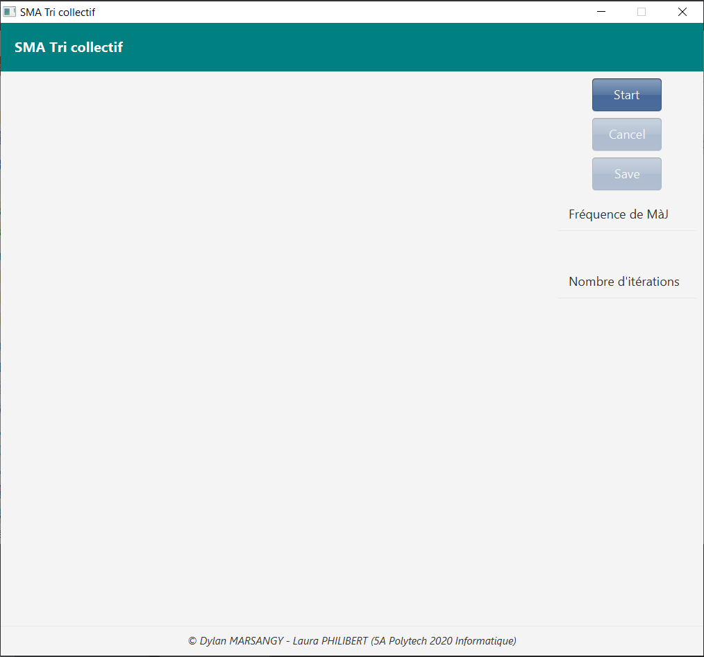
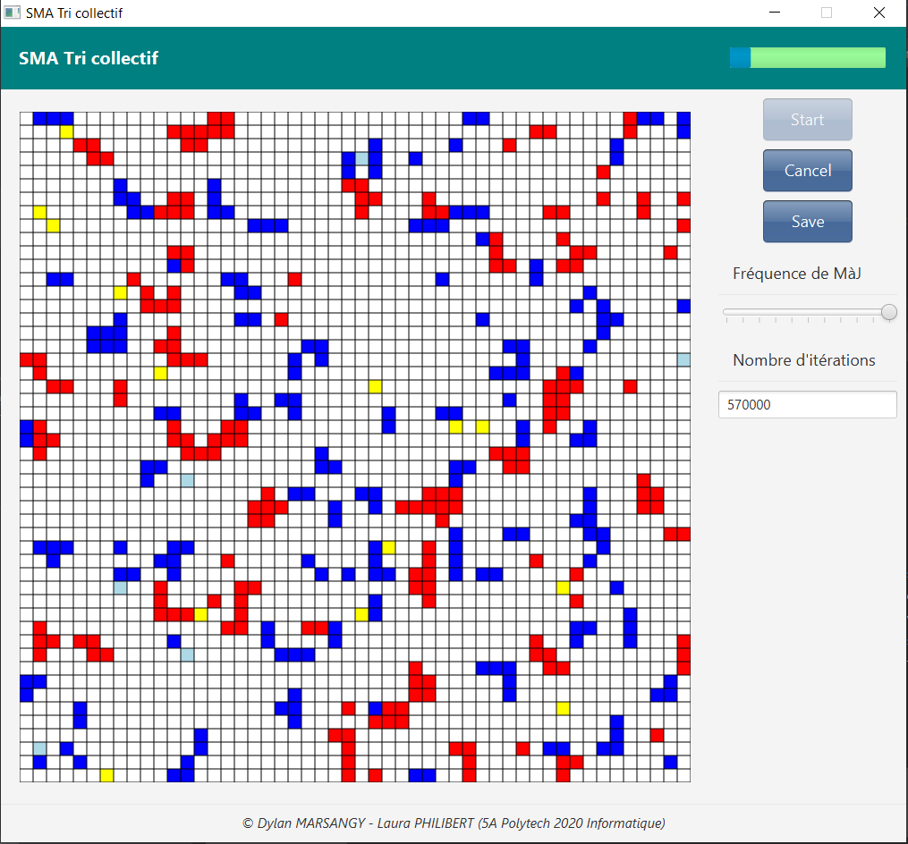
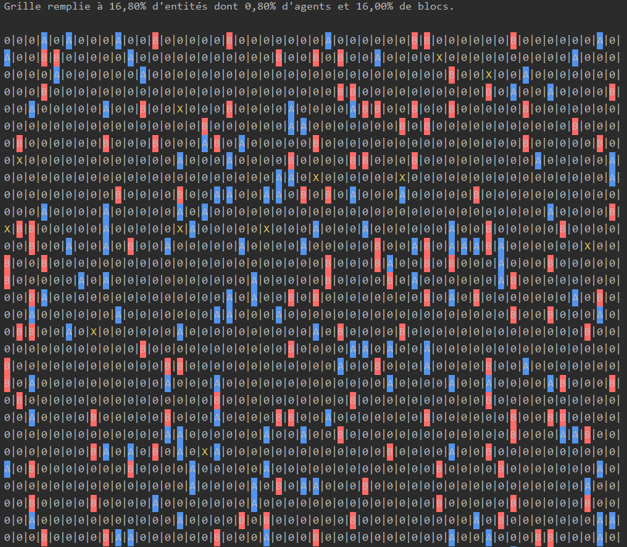

# 5A-SMA-Tri-Collectif
#### Dylan MARSANGY - Laura PHILIBERT

## Structure du projet

Le rendu du projet est le fichier `Rapport de TP de SMA.pdf` situé dans le dossier `doc/rendu/` à la racine du projet.
Dans ce même dossier se trouvent les fichiers Excels qui ont été à la base de notre analyse, situés dans le sous-dossier `sample`. 

Les autres dossiers sont les suivants :
- `doc/project` contient les énoncés du projet.
- `doc/screenshots/` contient des screenshots de l'application, utilisées dans ce README.
- `src/` contient les sources documentées de l'application.

## Prérequis
- Java 8.
- Maven 4.0

## Application

### Comportement d'un agent
- A chaque tour, un agent perçoit son environnement et effectue un déplacement aléatoire (en évitant toutefois de rencontrer un autre agent).
- Si l'agent ne tient pas de bloc et que sa destination est occupée par un bloc, il tente de le prendre. S'il réussit, il le prend et se déplace sur la case anciennement occupée par le bloc. Sinon, il ne fait rien et reste à sa place.
- S'il tient un bloc et que sa destination est libre, il y bouge en tentant de déposer au passage le bloc qu'il tient sur sa case d'origine. S'il réussit, il le fait. Sinon, il garde son bloc sur lui tant en effectuant son déplacement.

### Statistiques calculées à l'exécution
A chaque exécution de l'algorithme, diverses statistiques sont calculées afin d'estimer la qualité des paramètres donnés en entrée.
Nous nous sommes principalement concentrés sur les voisinages des blocs posés dans l'environnement à la fin de l'algorithme ainsi que sur les colonies formées.
Le détail des indicateurs calculés est disponible ci-dessous :
- Nombre de blocs A posés.
- Nombre de blocs B posés.
- Proportion de A voisins d'autres A.
- Proportion de A voisins de B.
- Proportion de B voisins d'autres B.
- Nombre de colonies.
- Taille moyenne d'une colonie (en nombre de blocs).
- Proportion de A par colonie.
- Proportion de B par colonie.

Ces indicateurs sont bien entendu extrêmement dépendants de la taille de voisinage choisie au départ.
Cette dernière peut être modifiée en changeant la valeur de la constante ```NEIGHBOURHOOD_SIZE``` de la classe ```SMAConstants```.

Les statistiques sont calculées sur plusieurs exécutions de l'algorithme avec les mêmes paramètres. 
Cela permet de moyenner les résultats obtenus et de réduire le nombre de cas extrêmes pouvant survenir.
Le nombre d'exécution peut être modifié en changeant la valeur de la constante ```NB_RUN``` de la classe ```SMAConstants```.

L'ensemble des statistiques après le lancement de l'application est enfin sauvegardé dans un fichier Excel au format xlsx nommé ```demo.xlsx``` contenu dans le dossier ```extern/stats/``` du projet.
Dans le cas où plusieurs tests sur les paramètres sont lancés (comme dans la classe ```ApplicationTest```), les résultats sont sauvegardés dans des feuilles de calcul différentes pour plus de lisibilité.
De plus, chaque tableau de résultat possède un en-tête rappelant les paramètres utilisés au lancement (nombre de blocs A et B, nombre d'agents, etc.).

Les exécutions de l'algorithme et le calcul des statistiques ont été réalisés en lançant l'application en mode test comme expliqué dans la partie [Lancer l'application - En mode test](#en-mode-test).

## Lancer l'application

### En mode main
Le mode 'main' permet d'exécuter l'algorithme une fois avec les paramètres par défaut donnés dans l'énoncé du projet.
Cela permet surtout de s'assurer de son bon fonctionnement.

Il est à noter qu'un nombre maximal de 1 600 000 itérations a été défini.
De manière générale, les constantes ont été définiées dans la classe `SMAConstants` à la racine du package `org/polytech` dans le dossier des sources `src/main/`.
Modifiez-les à votre guide avant d'exécuter l'algorithme.

Pour manipuler plus en détails l'algorithme (jouer avec les valeurs des paramètres), passez à la section [En mode test](#en-mode-test).

#### Avec le JAR (conseillé)
Exécutez le jar de l'application en exécutant la commande `java -jar SMA-Tri-Collectif-1.0-SNAPSHOT.jar` dans un terminal de commande.
Ce projet se situe dans le dossier `target/artifact/` à la racine du projet.

Le jar exécute l'application avec une UI réalisée sous JavaFX.
De plus, la progression de l'algorithme est affichée régulièrement dans la console.

**Windows n'est pas votre ami !**
> Par défaut, le codage ANSI n'est pas activé dans la console Windows. Or l'affichage est basé sur ce codage (affichage couleur).
> Pour l'activer, suivez ce [tutoriel](https://superuser.com/questions/413073/windows-console-with-ansi-colors-handling/1300251#1300251).

L'affichage console fonctionne correctement, sans configuration supplémentaire, sous Linux.

#### Depuis les sources (déconseillé)
##### Sans l'UI (affichage console)
Exécutez la fonction `main` de la classe `SMApplicationV1` à la racine du package `org/polytech/` dans le dossier des sources `src/main/`.

La progression de l'algorithme est affichée régulièrement dans la console.

##### Avec l'UI
Exécutez la fonction `main` de la classe `ViewSystemMA` du package `org/polytech/view` dans le dossier des sources `src/main/`.

### En mode test
Le mode test permet de jouer avec les différents paramètres.

Pour ce faire, exécutez la classe `ApplicationTest` dans le package `org/polytech/` du dossier des tests `src/test/`.
Cela va résulter en l'exécution de différents tests paramétrés écrits à l'aide de la librairie `JUnit 5`.

Chaque test paramétré ressemble à ceci :
```
@ParameterizedTest
@DisplayName("Run Application - Error (e)")
@ValueSource(doubles = {ERROR, 0.1, 0.5, 0.9})
public void runApplication_error(double error) {
    runSimulation(NUMBER_BLOCKS_A, NUMBER_BLOCKS_B, NUMBER_AGENTS,
                  GRID_ROWS, GRID_COLUMNS,
                  MEMORY_SIZE, SUCCESSIVE_MOVEMENTS, K_MINUS, K_PLUS, error);
}
```
Modifiez les valeurs présentes dans l'annotation `@ValueSource`. Un test sera exécuté pour chacune de ces valeurs sur le paramètre en question (ici, la probabilité d'erreur e).
Les autres paramètres ont une valeur par défaut attribuée qu'il est possible de modifier directement dans les attributs de ladite classe.

Il existe un de ces tests pour chacun des 10 paramètres.
A la fin des exécutions de tous les tests, un fichier Excel est généré et sauvegardé dans le dossier `extern/demo/`.
Ce fichier Excel a été à la base de notre analyse pour le rapport comme expliqué comme dans la partie [Statistiques calculées à l'exécution](#statistiques-calcules--lexcution).

## Démonstration
Cette démonstration se concentre essentiellement sur l'explication de l'UI.

Au démarrage de l'application, la fenêtre suivante s'ouvre :


*Démarrage de l'application*

Appuyer sur le bouton `Start` du menu de droite génère un système (composé d'un environnement et d'agents placés aléatoirement sur la grille de celui-ci).
Son état initial sera affiché à l'écran et l'algorithme de tri collectif se lance alors.


*Exécution de l'algorithme de tri*

Au milieu de l'écran apparaît la grille de l'environnement du système généré.
La grille renseigne sur l'emplacement des blocs et des agents.
- Les cases blanches correspondent à une case vide.
- Les cases bleues correspondent aux blocs A.
- Les cases rouges correspondent aux blocs B.
- Les cases jaunes correspondant aux agents ne tenant pas de bloc.
- Les bases bleues pâles correspondent aux agents tenant un bloc A.
- Les cases rouges pâles correspondent aux agents tenant un bloc B.
La progression de l'algorithme se fait en temps réel sur la grille.

Une barre de progression apparaît dans le coin supérieur droit de l'écran lorsque l'algorithme est exécuté.
Elle indique la progression de l'algorithme et permet donc de renseigner sur le nombre d'itérations restant.

Le bouton `Cancel` du menu de droite permet d'arrêter l'algorithme en pleine exécution.
Ré-appuyer sur le bouton `Start` génère un nouveau système et lance l'exécution de l'algorithme sur celui-ci.
Le bouton `Save` permet d'exporter la grille en une image png qui sera enregistrée dans le dossier `extern/snapshots/`.

Le menu de droite fournit également deux inputs supplémentaires :
- Une barre permettant d'ajuster avec le curseur la fréquence de mise à jour visuelle de la grille.
- Le nombre d'itérations maximal de l'algorithme de tri.
Par défaut, la grille est visuellement mise à jour à chaque itération mais il est possible avec le premier input de changer ce comportement pour ne la mettre à jour qu'une fois sur dix par exemple.
Si la fréquence est à 0, seul l'état final de l'environnement du système sera affiché.
La modification de la fréquence ou du nombre maximal d'itérations agit immédiatement sur l'algorithme, ce qui permet donc d'interagir en temps réel avec lui.

Lors d'une nouvelle exécution d'un algorithme, les inputs sont réinitialisés à leur valeur par défaut.
Lorsqu'une exécution est terminée, un fichier Excel est généré et sauvegardé dans le dossier `extern/stats/`.

Il est à noter que de manière régulière, la progression de l'algorithme est également affichée dans la console comme ci-dessous :



Cette grille affichée en console renseigne sur l'emplacement des blocs et des agents dans l'environnement à un instant donné.
- Les `0` blancs correspondent à une case vide.
- Les `A` surlignés en bleu correspondent aux blocs A.
- Les `B` surlignés en rouge correspondent aux blocs B.
- Les `X` jaunes correspondant aux agents ne tenant pas de bloc.
- Les `X` bleus correspondent aux agents tenant un bloc A.
- Les `X` rouges correspondent aux agents tenant un bloc B.
La progression de l'algorithme se fait en temps réel sur la grille.